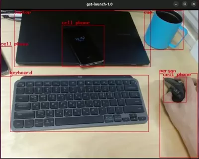

# yolov5, yolov8 object detection example with simple gstreamer pipeline


## 1. Yolov5

### Install yolov5

```bash
$ git clone https://github.com/ultralytics/yolov5
$ cd yolov5
$ pip install -r requirements.txt
```
And download weight files in https://github.com/ultralytics/yolov5/releases/tag/v7.0

### Export to tflite and torchscript model

```bash
$ python export.py --weights=yolov5s.pt --img=320 --include tflite torchscript
$ ls
... yolov5s.torchscript yolov5s-fp16.tflite ...
```

### Export to quantized tflite model
```bash
$ python export.py --weights=yolov5s.pt --img=320 --include tflite --int8
... yolov5s-int8.tflite ...
```

Note that setting the input image size as 320px, rather than the default 640px to increase inference speed. You can take other weight options (n, s, m, l, x) and input image size.

### Run the object detection example

```bash
$ ./gst-launch-object-detection-yolov5-tflite.sh
$ ./gst-launch-object-detection-yolov5-tflite.sh quantize ## use quantized tflite model
$ ./gst-launch-object-detection-yolov5-torchscript.sh
```

## 2. Yolov8

### Install yolov8

```bash
$ pip install ultralytics
```

### Export to tflite and torchscript model

REF: https://github.com/ultralytics/ultralytics#documentation
```python
from ultralytics import YOLO

# Load a model
model = YOLO("yolov8s.pt") # load a pretrained model

# Export the model
model.export(format="tflite", imgsz=320) # export the model to tflite format
model.export(format="torchscript", imgsz=320) # export the model to torchscript format

```

Note that setting the input image size as 320px, rather than the default 640px to increase inference speed. You can take other weight options (n, s, m, l, x) and input image size.

### Run the object detection example

```bash
$ ./gst-launch-object-detection-yolov8-tflite.sh
$ ./gst-launch-object-detection-yolov8-torchscript.sh
```

### Screenshot


